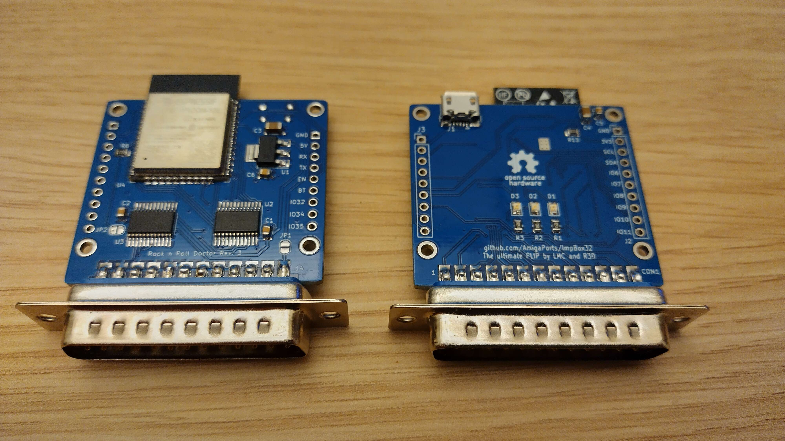

# ImpBox32

<center></center>

This device provides wireless connectivity to your Amiga.
The primary purpose is for use with [IMP](http://aminet.net/package/mus/play/imp3), but with proper firmware it can act as general-purpose network interface.

## Using the IMP firmware

### Flashing the device

Flash the device with firmware from `firmware_impbox` directory - you can use RX/TX pin header for this using typical ESP32 tooling.

The IMP firmware automatically updates itself, so you need to flash it manually only once.

### Using with IMP3

The firmware makes use of SD1306 or compatible OLED I2C display - be sure to connect one at least during registration and configuration phase.

The IMP firmware requires inputing registration key.
Getting the key is free but they are issued per-person to limit users during beta phase.
Contact Juen on EAB for getting one.
See messages displayed on OLED for detailed instructions on how to enter your key.

to configure WiFi network, use following commands:

```plain
imp3 ibcs your_ssid
imp3 ibcp your_password
```

Device stores the key as well as network parameters in its flash memory, hence configuration needs to be done only once.
Once configured, to launch IMP, type:

```plain
imp3 ib
```

## Differences between PCB revisions

Be sure to use the latest PCB revision - old ones are buggy and not supported.

The board currently recommended by IMP authors is rev3.
There's also rev3s board with SD card slot which cauld be made to work with modified sdbox firmware, and will be eventually suported by the universal firmware.

## Using the universal firmware

TBD - this firmware is currently not available.
